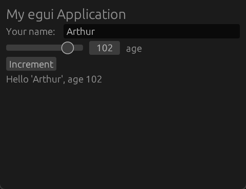

# rusty + javy

exploring project panama

journey
- https://www.rust-lang.org/learn/get-started
    - download rustup-init.exe (64-Bit)
    - install vscode plugin: rust-lang.rust-analyzer
    - [cargo init](https://github.com/rust-lang/cargo/issues/1549)
    - cargo run?
        - error 
        ```shell
        Compiling rusty-playground v0.1.0
        error: linker `link.exe` not found
        |
        = note: program not found

        note: the msvc targets depend on the msvc linker but `link.exe` was not found

        note: please ensure that Visual Studio 2017 or later, or Build Tools for Visual Studio were installed with the Visual C++ option.

        note: VS Code is a different product, and is not sufficient.

        error: could not compile `rusty-playground` (bin "rusty-playground") due to 1 previous error
        ```
    
        - ~~will this solve? https://stackoverflow.com/a/64121601/8812880~~ nope, solved with the next step
            - commenter said this is a workaround hmm, haven't tried this yet
    - I was not reading properly, I should install Visual Studio with "Desktop development with C++" as rustup-init.exe says
     
    ```shell
    Finished `dev` profile [unoptimized + debuginfo] target(s) in 0.01s
    Running `target\debug\rusty-playground.exe`
    Hello, Rusty world!
    ```

- egui
    - cargo add egui
    - copy example from egui readme
        - `cargo run` -> error
    - copy example from https://github.com/emilk/egui/blob/main/examples/hello_world/src/main.rs
        - `cargo run` -> error
    - cargo add eframe
        - comment out `env_logger::init()`
        - `cargo run` ->

        

- panama, episode 1
    - https://jornvernee.github.io/java/panama/rust/panama-ffi/2021/09/03/rust-panama-helloworld.html
    - cargo add cbindgen
    - cargo build

    ```shell
    error: failed to parse manifest at `\Cargo.toml`

    Caused by:
        can't find library `rusty_playground`, rename file to `src/lib.rs` or specify lib.path
    ```

    - cargo install cbindgen
        - still err
        - cargo uninstall cbindgen
    
    - ohhh, it's [build-dependencies] not [dependencies], my mind somehow didn't diff the two


    - from above article,, modified
        ```shell
        jextract -d classes -t org.openjdk --include-function hello_world -l egui_panama -- lib.h
        ```
        - error, duh, download add jextract to path (https://jdk.java.net/jextract/)

        - error again, now hmm
        ```powershell
        jextract : File \jextract-22\bin\jextract.ps1 cannot be loaded. The file \jextract-22\bin\jextract.ps1 is not digitally 
        signed. You cannot run this script on the current system. For more information about running scripts and setting execution policy, see about_Execution_Policies at 
        https:/go.microsoft.com/fwlink/?LinkID=135170.
        ```

        - solution don't run in powershell

        - error, the command in the article is old and not working

        - this works
        ```shell
        jextract --output "target/java-classes" -t org.openjdk --include-function hello_world -l egui_panama lib.h
        ```

        - change build.rs so it outputs to "target/headers
        ```shell
        jextract --output "target/java-classes" -t org.openjdk --include-function hello_world -l egui_panama target/headers/lib.h
        ```

- next, panama ep 2

    - calling from java, from the article, modified
    ```shell
    java --enable-preview --enable-native-access=ALL-UNNAMED -Djava.library.path=./target/debug -cp ./target/java-classes HelloRustFromJava.java
    ```

    - still error, moving to https://github.com/openjdk/jextract/blob/master/doc/GUIDE.md

    - ohh, jextract creates .java file, I have to compile them first. ref: https://github.com/openjdk/jextract/blob/master/samples/helloworld/compilesource.sh

    IT WORKS!!!!!!!

# working steps

```shell
cargo clean
cargo build

jextract --include-dir target/headers --output java/src --target-package self.chera --library rustyplayground target/headers/lib.h --use-system-load-library

javac --source=22 -d java/classes java/src/self/chera/*.java

java --enable-preview --enable-native-access=ALL-UNNAMED -Djava.library.path=./target/debug -cp ./java/classes HelloRustFromJava.java
```


- the egui
    - vibing with chatgpt, it sucks, go some ideas, then learning from https://github.com/kaphula/winit-egui-wgpu-template
